# How To

Let's write a short description of how all this works after somone [sponsors us](https://github.com/sponsors/HoudiniGraphql). (🙏 Many thanks 💖)

## Process

```mermaid
sequenceDiagram
    actor YOU as You
    participant SP as GitHub Sponsoring Page
    Note right of SP: Webhook setup
    participant HS as Houdini Site
    Note right of HS: Handler with: WEBHOOK_PATH
    Note right of HS: Handler with: GITHUB_TOKEN
    participant SG as Repo Sponsors Generator


    YOU->>+SP: New Sponsor 💖
    SP->>+SP: GitHub Sponsor process
    SP->>+HS: Webhook (generate new asset)
    HS->>+SG: Webhook (trigger "update-sponsors" action)
    SG->>+SG: New Asset
    SG->>-HS: You are on the asset
    Note right of HS: https://houdinigraphql.com/_sponsors
    YOU->>YOU: 🙏 Thx a lot 🙏

```



<br />
<br />

## How update sponsors assets?

Call the workflow with the following command:

_`<YOUR-TOKEN>` Requires the `repo` scope._

```bash
curl -L \
  -X POST \
  -H "Accept: application/vnd.github+json" \
  -H "Authorization: Bearer <YOUR-TOKEN>" \
  -H "X-GitHub-Api-Version: 2022-11-28" \
  https://api.github.com/repos/HoudiniGraphql/sponsors/actions/workflows/generate.yml/dispatches \
  -d '{"ref":"main"}'
```
